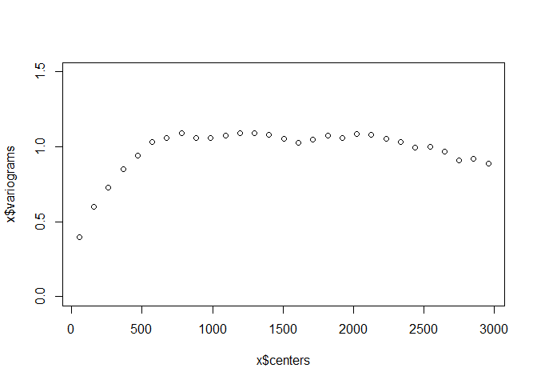

Prueba 1
================
Javier Ramos
October 26, 2021

## Carga de datos y librerías

Se cargará la data y las librerías necesarias para el posterior
análisis.

``` r
#Dataframe
df = read.table(file = "data.txt", header = TRUE)

#Librerías
library(mapproj)
```

    ## Loading required package: maps

``` r
library(devtools)
```

    ## Loading required package: usethis

``` r
library(fields)
```

    ## Loading required package: spam

    ## Loading required package: dotCall64

    ## Loading required package: grid

    ## Spam version 2.7-0 (2021-06-25) is loaded.
    ## Type 'help( Spam)' or 'demo( spam)' for a short introduction 
    ## and overview of this package.
    ## Help for individual functions is also obtained by adding the
    ## suffix '.spam' to the function name, e.g. 'help( chol.spam)'.

    ## 
    ## Attaching package: 'spam'

    ## The following objects are masked from 'package:base':
    ## 
    ##     backsolve, forwardsolve

    ## Loading required package: viridis

    ## Loading required package: viridisLite

    ## 
    ## Attaching package: 'viridis'

    ## The following object is masked from 'package:maps':
    ## 
    ##     unemp

    ## See https://github.com/NCAR/Fields for
    ##  an extensive vignette, other supplements and source code

``` r
library(geoR)
```

    ## --------------------------------------------------------------
    ##  Analysis of Geostatistical Data
    ##  For an Introduction to geoR go to http://www.leg.ufpr.br/geoR
    ##  geoR version 1.8-1 (built on 2020-02-08) is now loaded
    ## --------------------------------------------------------------

``` r
library(GeoModels)
```

    ## Loading required package: GPvecchia

    ## Loading required package: plot3D

    ## Loading required package: shape

``` r
library(nortest)
require(fitdistrplus)
```

    ## Loading required package: fitdistrplus

    ## Loading required package: MASS

    ## Loading required package: survival

## Pregunta A

### Desarrollo:

``` r
#Radio de la tierra
r = 6371

#Separar las columnas de longitud y latitud
x = df[,1]
y = df[,2]

#Se procede a realizar la proyección sinusoidal
prj_sinusoidal = mapproject(x, y, projection="sinusoidal",orientation=c(90,0,0)) 
result = r*cbind(prj_sinusoidal$x,prj_sinusoidal$y)
df2 = cbind(result, df[,3])

#Se renombran las filas y las columnas para facilitar la lectura de la tabla
colnames(df2) <- c("lon", "lat", "anom")
rownames(df2) <- 1:nrow(df2)
#df2
```

## Pregunta B

### Desarrollo:

Primero se realizará un análisis gráfico:

``` r
par(mfrow = c(1,3))

#Histograma
hist(df2[,3], main = "Histograma", xlab = "Datos",ylab = "Frecuencia")

#Boxplot
boxplot(df2[,3], main = "Boxplot")

#Gráfico de cuantiles
qqnorm(df2[,3], pch = 19, col = "gray50", main = "Simetría", xlab = "Cuantiles Teóricos", ylab = "Cuantiles Muestrales")
qqline(df2[,3])
```

<!-- -->

En base a lo anterior, se puede ver que los datos podrían seguir una
distribución normal. Ahora bien, para ser más precisos, se realizará un
test de hipotesis:

``` r
lillie.test(df2[,3])
```

    ## 
    ##  Lilliefors (Kolmogorov-Smirnov) normality test
    ## 
    ## data:  df2[, 3]
    ## D = 0.037552, p-value = 0.002051

El resultado indica que se retiene H0 con un valor-p = 0,002 &lt; 0,05 =
alpha. Por lo tanto, los datos distribuyen normal y **el modelo
Gaussiano sí es adecuado**.

## Pregunta C

### Desarrollo:

Primero se calculará la distancia máxima

``` r
points = cbind(df2[,1], df2[,2])
maxdist = max(dist(points))
```

Ahora se procede a realizar el análsis del semivariograma

``` r
svario = GeoVariogram(coordx = points, data= df2[,3], maxdist = maxdist/2, numbins = 30)
plot(svario$centers, svario$variograms, ylim = c(0, 1.5))
```

<!-- --> A partir del
gráfico se puede ver que tiende a estabilizarse, lo que indicaría que
hay estacionaridad débil. Ahora bien, a simple vista no se puede
apreciar si hay un efecto nugget, por lo que para poder apreciar mejor
la situación, se ampliará el gráfico cerca de cero:

``` r
svario = GeoVariogram(coordx = points, data= df2[,3], maxdist = 10, numbins = 10)
plot(svario$centers, svario$variograms, ylim = c(0, 1))
```

<!-- -->

Por lo que se ve en el gráfico, **no hay un efecto nugget**. Ahora bien,
se analizará el semivariograma en distintas direcciones para determinar
si hay isotropía:

``` r
svario2 = variog4(coords = points, data = df2[,3], max.dist = maxdist/2)
```

    ## variog: computing variogram for direction = 0 degrees (0 radians)
    ##         tolerance angle = 22.5 degrees (0.393 radians)
    ## variog: computing variogram for direction = 45 degrees (0.785 radians)
    ##         tolerance angle = 22.5 degrees (0.393 radians)
    ## variog: computing variogram for direction = 90 degrees (1.571 radians)
    ##         tolerance angle = 22.5 degrees (0.393 radians)
    ## variog: computing variogram for direction = 135 degrees (2.356 radians)
    ##         tolerance angle = 22.5 degrees (0.393 radians)
    ## variog: computing omnidirectional variogram

``` r
plot(svario2, omni = TRUE)
```

<!-- -->

Al analizar el gráfico, se puede ver que aunque existen variaciones en
las distintas direcciones, siguen manteniendo el mismo patrón y se
mueven junto a la línea omnid. Entonces, **sí hay isotropía**.

## Pregunta D

### Desarrollo:

Si se asume independencia, se tiene lo siguiente:

``` r
fitmlind = fitdist(df2[,3], "norm")
fitmlind
```

    ## Fitting of the distribution ' norm ' by maximum likelihood 
    ## Parameters:
    ##        estimate Std. Error
    ## mean 0.02597329 0.02720820
    ## sd   0.86039892 0.01923899

Ahora bien, para comprobar que haber asumido la independencia sea
correcto, se verá gráficamente:

``` r
par(mfrow = c(1,2))
denscomp(fitmlind)
qqcomp(fitmlind)
```

<!-- -->

Al ver los gráficos, se puede ver que el modelo está funcionando bien,
por lo que sí sería correcto asumir independencia. Por lo tanto, la
**media es 0,02597** y la **desviación estándar es 0,86039**

Luego, se realizará otro método para encontrar los valores óptimos:

``` r
nugget = 0
smooth = 0.5
mean = 0
sill = 1
scale = 0.2/3
corrmodel = "Matern"
I=Inf

fixed <- list(smooth = smooth, nugget = nugget)
start <- list(mean=mean, scale=scale, sill=sill)
lower <- list(mean=-I, scale=0, sill=0)
upper <- list(mean=I, scale=I, sill=I)
fit0  <- GeoFit(data=df[,3], coordx=points, corrmodel=corrmodel, neighb=3,
                    optimizer="nlminb",upper=upper,lower=lower,
                    likelihood="Full",type="Standard", sensitivity=TRUE,
                    start= start, fixed=fixed)
print(fit0)
```

    ## 
    ## ##################################################################
    ## Maximum  Likelihood Fitting of Gaussian Random Fields
    ## 
    ## Setting: Full Likelihood 
    ## 
    ## Model: Gaussian 
    ## 
    ## Type of the likelihood objects: Standard 
    ## 
    ## Covariance model: Matern 
    ## 
    ## Optimizer: nlminb 
    ## 
    ## Number of spatial coordinates: 1000 
    ## Number of dependent temporal realisations: 1 
    ## Type of the random field: univariate 
    ## Number of estimated parameters: 3 
    ## 
    ## Type of convergence: Successful 
    ## Maximum log-Likelihood value: -1268.58
    ## AIC : 2543 
    ## BIC : 2558 
    ## 
    ## Estimated parameters:
    ##    mean    scale     sill  
    ## 0.02597  0.06667  0.74029  
    ## 
    ## ##################################################################

Luego, se tiene que la **media es 0,02597** y la **varianza es
0,74029**. Cabe destacar que el resultado es independiente de la
dependencia espacial, ya que esta siempre será el valor que se pone de
partida. Por otro lado, los valores obtenidos son los mismos que los de
recién (la desviación estándar basta con elevarla al cuadrado y dará el
mismo resultado que se obtuvo):

``` r
fitmlind$estimate[2]^2
```

    ##        sd 
    ## 0.7402863

Así se puede ver que el resultado es el mismo.

## Pregunta E

### Desarrollo:

Cuando el parámetro nu es igual a 0.5 ocurre un caso especial en el que
el modelo de Matern se convierte en el modelo exponencial. Ahora bien,
este parámetro de suavizamiento lo que indica es cuántas veces es
diferenciable en media cuadrática el campo aleatorio.

## Pregunta F

### Desarrollo:

``` r
nugget = 0
smooth = 0.5
mean = 0
sill = 1
scale = 0.2/3
corrmodel = "Matern"
I=Inf


fixed <- list(smooth = smooth)
start <- list(mean=mean, scale=scale, sill=sill, nugget = nugget)
lower <- list(mean=-I, scale=0, sill=0, nugget = 0)
upper <- list(mean=I, scale=I, sill=I, nugget = I)
fit1  <- GeoFit(data=df[,3], coordx=points, corrmodel=corrmodel, neighb=3,
                    optimizer="nlminb",upper=upper,lower=lower,
                    likelihood="Full",type="Standard", sensitivity=TRUE,
                    start= start, fixed=fixed)
print(fit1)
```

    ## 
    ## ##################################################################
    ## Maximum  Likelihood Fitting of Gaussian Random Fields
    ## 
    ## Setting: Full Likelihood 
    ## 
    ## Model: Gaussian 
    ## 
    ## Type of the likelihood objects: Standard 
    ## 
    ## Covariance model: Matern 
    ## 
    ## Optimizer: nlminb 
    ## 
    ## Number of spatial coordinates: 1000 
    ## Number of dependent temporal realisations: 1 
    ## Type of the random field: univariate 
    ## Number of estimated parameters: 4 
    ## 
    ## Type of convergence: Successful 
    ## Maximum log-Likelihood value: -1268.58
    ## AIC : 2545 
    ## BIC : 2565 
    ## 
    ## Estimated parameters:
    ##    mean   nugget    scale     sill  
    ## 0.02597  0.01881  0.06667  0.72147  
    ## 
    ## ##################################################################

Los valores encontrados no varían con respecto a lo obtenido en D, y el
valor del *nugget es 0.01881*

## Pregunta G

### Desarrollo:

Al considerar un nugget no hay continuidad en media cuadrática y,
además, no hay diferenciabilidad.

## Pregunta H

### Desarrollo:

Al analizar el criterio de Akike se tiene que:

``` r
fit0$claic
```

    ## [1] 2543.159

``` r
fit1$claic
```

    ## [1] 2545.159

Al ver entre ambos casos, se debería escoger primer modelo, es decir, el
**modelo sin nugget es el mejor**. Sin embargo, cabe destacar que la
diferencia entre ambos llega a ser ínfima.

## Pregunta I

### Desarrollo:

Se tiene lo siguiente:

``` r
res = GeoResiduals(fit0)

par(mfrow = c(1,2))
hist(res$data, prob = T, xlab = "Residuals")
x=seq(-4,4,0.1)
lines(x, dnorm(x, mean = 0, sd = 1), col = "blue",lwd=2)

GeoQQ(res)
```

<!-- -->

``` r
### computing semivariogram for residuals
variores = GeoVariogram(data=res$data,coordx=points,maxdist=maxdist/2, numbins = 30)
plot(variores, ylim = c(0, 1.5))
```

<!-- -->

``` r
# Comparing estimated  semivariogram model versus empirical semivariogram 
GeoCovariogram(res,show.vario=TRUE, vario=variores,pch=20)
```

<!-- -->
