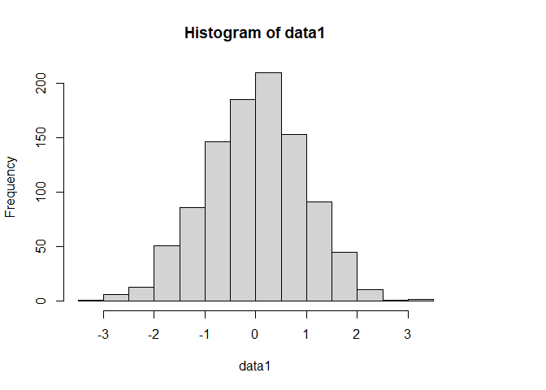
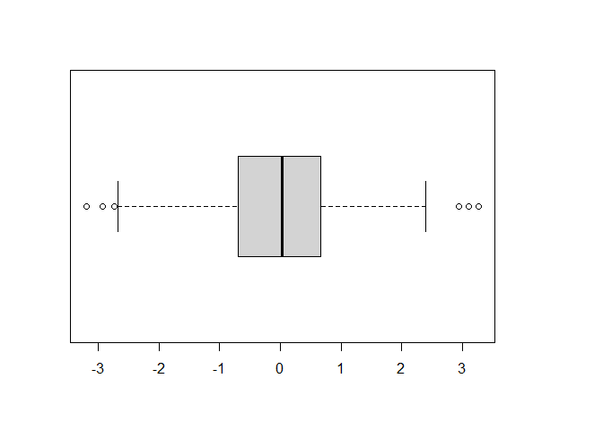

Prueba 1 - Javier Ramos
================

## Carga de datos y librerías

Se cargará la data y las librerías necesarias para el posterior
análisis.

``` r
#Dataframe
df = read.table(file = "data.txt", header = TRUE)

#Librerías
library(mapproj)
```

    ## Loading required package: maps

``` r
library(devtools)
```

    ## Loading required package: usethis

``` r
library(fields)
```

    ## Loading required package: spam

    ## Loading required package: dotCall64

    ## Loading required package: grid

    ## Spam version 2.7-0 (2021-06-25) is loaded.
    ## Type 'help( Spam)' or 'demo( spam)' for a short introduction 
    ## and overview of this package.
    ## Help for individual functions is also obtained by adding the
    ## suffix '.spam' to the function name, e.g. 'help( chol.spam)'.

    ## 
    ## Attaching package: 'spam'

    ## The following objects are masked from 'package:base':
    ## 
    ##     backsolve, forwardsolve

    ## Loading required package: viridis

    ## Loading required package: viridisLite

    ## 
    ## Attaching package: 'viridis'

    ## The following object is masked from 'package:maps':
    ## 
    ##     unemp

    ## See https://github.com/NCAR/Fields for
    ##  an extensive vignette, other supplements and source code

``` r
library(geoR)
```

    ## --------------------------------------------------------------
    ##  Analysis of Geostatistical Data
    ##  For an Introduction to geoR go to http://www.leg.ufpr.br/geoR
    ##  geoR version 1.8-1 (built on 2020-02-08) is now loaded
    ## --------------------------------------------------------------

``` r
library(GeoModels)
```

    ## Loading required package: GPvecchia

    ## Loading required package: plot3D

    ## Loading required package: shape

## Pregunta A

### Desarrollo:

``` r
#Radio de la tierra
r = 6371

#Separar las columnas de longitud y latitud
x = df[,1]
y = df[,2]

#Se procede a realizar la proyección sinusoidal
prj_sinusoidal = mapproject(x, y, projection="sinusoidal",orientation=c(90,0,0)) 
result = r*cbind(prj_sinusoidal$x,prj_sinusoidal$y)
df2 = cbind(result, df[,3])

#Se renombran las filas y las columnas para facilitar la lectura de la tabla
colnames(df2) <- c("lon", "lat", "anom")
rownames(df2) <- 1:nrow(df2)
#df2
```

## Pregunta B

### Desarrollo:

Primero se realizará la simulación a través del modelo de Matern

``` r
sill = 1
mean = 0
nugget = 0
smooth = 0.5
scale = 0.1

param=list(smooth=smooth,mean=mean,sill=sill,scale=scale,nugget=nugget) 
data1 <- GeoSim(coordx=df2[,1],coordy = df2[,2], corrmodel="Matern", param=param)$data
```

Luego, se procede a realizar un análisis gráfico:

``` r
#quilt.plot(df2[,1], df2[,2], data1, xlab="", ylab="", main=paste("Matern",expression(nu),"=",smooth))
quilt.plot(df2[,1], df2[,2], data1)
```

<!-- -->

``` r
hist(data1)
```

<!-- -->

``` r
boxplot(data1)
```

<!-- -->

A partir del boxplot se puede determinar que hay outliers, pero que
estos son simétricos. Respecto al histograma, claramente hay un
comportamiento de normalidad y respecto al gráfico de colores no se ve
con tanta claridad si hay o no una dependencia. Por lo tanto, sí se
puede decir que el modelo Gaussiano es adecuado.

## Pregunta C

### Desarrollo:

## Pregunta D

### Desarrollo:

## Pregunta E

### Desarrollo:

## Pregunta F

### Desarrollo:

## Pregunta G

### Desarrollo:

## Pregunta H

### Desarrollo:

## Pregunta I

### Desarrollo:
