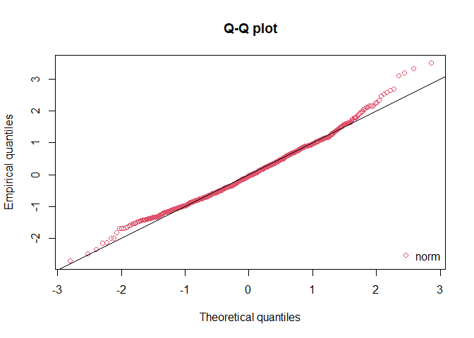

Prueba 1 - Javier Ramos
================

## Carga de datos y librerías

Se cargará la data y las librerías necesarias para el posterior
análisis.

``` r
#Dataframe
df = read.table(file = "data.txt", header = TRUE)

#Librerías
library(mapproj)
```

    ## Loading required package: maps

``` r
library(devtools)
```

    ## Loading required package: usethis

``` r
library(fields)
```

    ## Loading required package: spam

    ## Loading required package: dotCall64

    ## Loading required package: grid

    ## Spam version 2.7-0 (2021-06-25) is loaded.
    ## Type 'help( Spam)' or 'demo( spam)' for a short introduction 
    ## and overview of this package.
    ## Help for individual functions is also obtained by adding the
    ## suffix '.spam' to the function name, e.g. 'help( chol.spam)'.

    ## 
    ## Attaching package: 'spam'

    ## The following objects are masked from 'package:base':
    ## 
    ##     backsolve, forwardsolve

    ## Loading required package: viridis

    ## Loading required package: viridisLite

    ## 
    ## Attaching package: 'viridis'

    ## The following object is masked from 'package:maps':
    ## 
    ##     unemp

    ## See https://github.com/NCAR/Fields for
    ##  an extensive vignette, other supplements and source code

``` r
library(geoR)
```

    ## --------------------------------------------------------------
    ##  Analysis of Geostatistical Data
    ##  For an Introduction to geoR go to http://www.leg.ufpr.br/geoR
    ##  geoR version 1.8-1 (built on 2020-02-08) is now loaded
    ## --------------------------------------------------------------

``` r
library(GeoModels)
```

    ## Loading required package: GPvecchia

    ## Loading required package: plot3D

    ## Loading required package: shape

``` r
library(nortest)
```

## Pregunta A

### Desarrollo:

``` r
#Radio de la tierra
r = 6371

#Separar las columnas de longitud y latitud
x = df[,1]
y = df[,2]

#Se procede a realizar la proyección sinusoidal
prj_sinusoidal = mapproject(x, y, projection="sinusoidal",orientation=c(90,0,0)) 
result = r*cbind(prj_sinusoidal$x,prj_sinusoidal$y)
df2 = cbind(result, df[,3])

#Se renombran las filas y las columnas para facilitar la lectura de la tabla
colnames(df2) <- c("lon", "lat", "anom")
rownames(df2) <- 1:nrow(df2)
#df2
```

## Pregunta B

### Desarrollo:

Primero se realizará un análisis gráfico:

``` r
par(mfrow = c(1,3))

#Histograma
hist(df2[,3], main = "Histograma", xlab = "Datos",ylab = "Frecuencia")

#Boxplot
boxplot(df2[,3], main = "Boxplot")

#Gráfico de cuantiles
qqnorm(df2[,3], pch = 19, col = "gray50", main = "Simetría", xlab = "Cuantiles Teóricos", ylab = "Cuantiles Muestrales")
qqline(df2[,3])
```

<!-- --> En base a lo
anterior, se puede ver que los datos podrían seguir una distribución
normal. Ahora bien, para ser más precisos, se realizará un test de
hipotesis:

``` r
lillie.test(df2[,3])
```

    ## 
    ##  Lilliefors (Kolmogorov-Smirnov) normality test
    ## 
    ## data:  df2[, 3]
    ## D = 0.037552, p-value = 0.002051

El resultado indica que se retiene H0 con un valor-p = 0,002 &lt; 0,05 =
alpha. Por lo tanto, los datos distribuyen normal y el modelo Gaussiano
sí es adecuado.

## Pregunta C

### Desarrollo:

Primero se calculará la distancia máxima

``` r
points = cbind(df2[,1], df2[,2])
maxdist = max(dist(points))
```

Ahora se procede a realizar el análsis del semivariograma

``` r
svario = GeoVariogram(coordx = points, data= df2[,3], maxdist = maxdist/2, numbins = 20)
plot(svario$centers, svario$variograms, ylim = c(0, 1.5))
```

<!-- --> Para poder
apreciar mejor la situación, se ampliará el gráfico cerca de cero:

``` r
svario = GeoVariogram(coordx = points, data= df2[,3], maxdist = 5, numbins = 10)
plot(svario$centers, svario$variograms, ylim = c(0, 1))
```

<!-- -->

Análisis de semivariograma en varias direcciones:

``` r
svario2 = variog4(coords = points, data = df2[,3], max.dist = maxdist/2)
```

    ## variog: computing variogram for direction = 0 degrees (0 radians)
    ##         tolerance angle = 22.5 degrees (0.393 radians)
    ## variog: computing variogram for direction = 45 degrees (0.785 radians)
    ##         tolerance angle = 22.5 degrees (0.393 radians)
    ## variog: computing variogram for direction = 90 degrees (1.571 radians)
    ##         tolerance angle = 22.5 degrees (0.393 radians)
    ## variog: computing variogram for direction = 135 degrees (2.356 radians)
    ##         tolerance angle = 22.5 degrees (0.393 radians)
    ## variog: computing omnidirectional variogram

``` r
plot(svario2, omni = TRUE)
```

<!-- -->

## Pregunta D

### Desarrollo:

## Pregunta E

### Desarrollo:

## Pregunta F

### Desarrollo:

## Pregunta G

### Desarrollo:

## Pregunta H

### Desarrollo:

## Pregunta I

### Desarrollo:

Primero se realizará la simulación a través del modelo de Matern

``` r
sill = 1
mean = 0
nugget = 0
smooth = 0.5
scale = 0.1

param=list(smooth=smooth,mean=mean,sill=sill,scale=scale,nugget=nugget) 
data <- GeoSim(coordx=df2[,1],coordy = df2[,2], corrmodel="Matern", param=param)$data
```

Luego, se procede a realizar un análisis gráfico:

``` r
#quilt.plot(df2[,1], df2[,2], data, xlab="", ylab="", main=paste("Matern",expression(nu),"=",smooth))
quilt.plot(df2[,1], df2[,2], data)
```

<!-- -->

``` r
hist(result)
```

<!-- -->

``` r
boxplot(result)
```

<!-- -->
