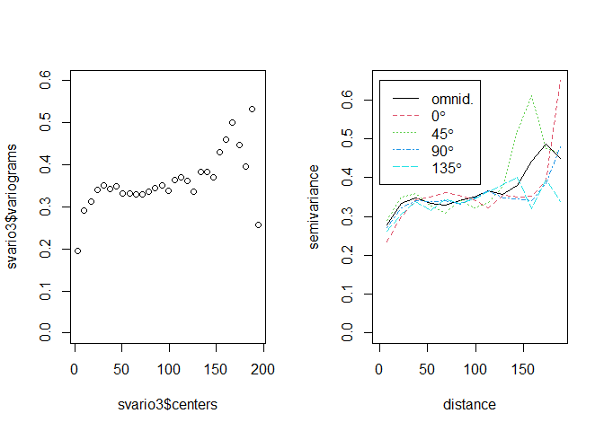

Prueba 2
================
Javier Ramos
November 1, 2021

## Carga de datos y librerías

Se cargará la data y las librerías necesarias para el posterior
análisis.

``` r
#Dataframe
raindata = read.table(file = "raindata.txt", header = TRUE)
alt = read.table(file = "alt.txt", header = TRUE)
coordstopred = read.table(file = "coordstopred.txt", header = TRUE)
alt2 = read.table(file = "alt2.txt", header = TRUE)

coords=raindata[,1:2]
data=raindata[,3]

#Librerías
library(mapproj)
```

    ## Loading required package: maps

``` r
library(devtools)
```

    ## Loading required package: usethis

``` r
library(fields)
```

    ## Loading required package: spam

    ## Loading required package: dotCall64

    ## Loading required package: grid

    ## Spam version 2.7-0 (2021-06-25) is loaded.
    ## Type 'help( Spam)' or 'demo( spam)' for a short introduction 
    ## and overview of this package.
    ## Help for individual functions is also obtained by adding the
    ## suffix '.spam' to the function name, e.g. 'help( chol.spam)'.

    ## 
    ## Attaching package: 'spam'

    ## The following objects are masked from 'package:base':
    ## 
    ##     backsolve, forwardsolve

    ## Loading required package: viridis

    ## Loading required package: viridisLite

    ## 
    ## Attaching package: 'viridis'

    ## The following object is masked from 'package:maps':
    ## 
    ##     unemp

    ## See https://github.com/NCAR/Fields for
    ##  an extensive vignette, other supplements and source code

``` r
library(geoR)
```

    ## --------------------------------------------------------------
    ##  Analysis of Geostatistical Data
    ##  For an Introduction to geoR go to http://www.leg.ufpr.br/geoR
    ##  geoR version 1.8-1 (built on 2020-02-08) is now loaded
    ## --------------------------------------------------------------

``` r
library(GeoModels)
```

    ## Loading required package: GPvecchia

    ## Loading required package: plot3D

    ## Loading required package: shape

``` r
library(nortest)
require(fitdistrplus)
```

    ## Loading required package: fitdistrplus

    ## Loading required package: MASS

    ## Loading required package: survival

## Pregunta A

### Desarrollo:

Primero se realizará un análisis gráfico:

``` r
par(mfrow = c(2,2))

#Histograma
hist(data, main = "Histograma", xlab = "Datos",ylab = "Frecuencia")

#Boxplot
boxplot(data, main = "Boxplot")

#Gráfico de cuantiles
qqnorm(data, pch = 19, col = "gray50", main = "Simetría", xlab = "Cuantiles Teóricos", ylab = "Cuantiles Muestrales")
qqline(data)

fitmlind = fitdist(data, "norm")
fitmlind
```

    ## Fitting of the distribution ' norm ' by maximum likelihood 
    ## Parameters:
    ##       estimate Std. Error
    ## mean 1.1198178 0.02622324
    ## sd   0.5857828 0.01854239

``` r
fitmlind$estimate
```

    ##      mean        sd 
    ## 1.1198178 0.5857828

``` r
fitmlind$loglik
```

    ## [1] -441.182

``` r
denscomp(fitmlind)
```

<!-- -->

A partir del análisis gáfico se puede ver que los datos distribuyen
normal. Esto se confirmará a través de un test de hipótesis:

``` r
lillie.test(data)
```

    ## 
    ##  Lilliefors (Kolmogorov-Smirnov) normality test
    ## 
    ## data:  data
    ## D = 0.055378, p-value = 0.0009199

El resultado indica que se retiene H0 con un valor-p = 0,00091 &lt; 0,05
= alpha. Por lo tanto, los datos distribuyen normal. Ahora bien, se
necesita contexto para poder determinar si es que el modelo Gaussiano es
adecuado y, considerendo que en este caso los datos son de cantidad de
lluvia, entonces se requiere un soporte positivo, lo que se complica con
el modelo Gaussiano ya que este está definido en todo R. Por lo tanto,
se concluye que **el modelo no es adecuado** para este caso

## Pregunta B

### Desarrollo:

Primero se calculará la distancia máxima

``` r
maxdist = max(dist(coords))
```

Ahora se procede a realizar el análsis del semivariograma

``` r
svario = GeoVariogram(coordx = coords, data= data, maxdist = maxdist/2, numbins = 30)
plot(svario$centers, svario$variograms, ylim = c(0, 1.5))
```

<!-- -->

A simple vista se ve estabilidad y, además, la posible presencia de un
nugget. Sobre esto último, se realizará un aumento en el gráfico entorno
al cero para poder determinar si hay un nugget o no:

``` r
svario = GeoVariogram(coordx = coords, data= data, maxdist = 10, numbins = 30)
plot(svario$centers, svario$variograms, ylim = c(0, 1.5))
```

<!-- -->

A partir de lo anterior se concluye que no hay presencia de un nugget.
Ahora bien, se analizará el semivariograma en diferentes direcciones:

``` r
svario2 = variog4(coords = coords, data = data, max.dist = maxdist/2)
```

    ## variog: computing variogram for direction = 0 degrees (0 radians)
    ##         tolerance angle = 22.5 degrees (0.393 radians)
    ## variog: computing variogram for direction = 45 degrees (0.785 radians)
    ##         tolerance angle = 22.5 degrees (0.393 radians)
    ## variog: computing variogram for direction = 90 degrees (1.571 radians)
    ##         tolerance angle = 22.5 degrees (0.393 radians)
    ## variog: computing variogram for direction = 135 degrees (2.356 radians)
    ##         tolerance angle = 22.5 degrees (0.393 radians)
    ## variog: computing omnidirectional variogram

``` r
plot(svario2, omni = TRUE)
```

<!-- -->

El comportamiento del semivariograma en distintias direcciones se
mantiene estable y, es por ello, que **sí es razonable la hipotesis de
isotropía**.

## Pregunta C

### Desarrollo:

No es débilmente estacionario, ya que la varianza depende de la media y
esta última es espacialemente variable. Además, esto se confirma ver los
gráficos planteados anteriormente, pero considerando la distancia
máxima:

``` r
svario3 = GeoVariogram(coordx = coords, data= data, maxdist = maxdist, numbins = 30)
svario4 = variog4(coords = coords, data = data, max.dist = maxdist)
```

    ## variog: computing variogram for direction = 0 degrees (0 radians)
    ##         tolerance angle = 22.5 degrees (0.393 radians)
    ## variog: computing variogram for direction = 45 degrees (0.785 radians)
    ##         tolerance angle = 22.5 degrees (0.393 radians)
    ## variog: computing variogram for direction = 90 degrees (1.571 radians)
    ##         tolerance angle = 22.5 degrees (0.393 radians)
    ## variog: computing variogram for direction = 135 degrees (2.356 radians)
    ##         tolerance angle = 22.5 degrees (0.393 radians)
    ## variog: computing omnidirectional variogram

``` r
par(mfrow = c(1,2))
plot(svario3$centers, svario3$variograms, ylim = c(0, 1.5))
plot(svario4, omni = TRUE)
```

<!-- -->

Al analizar los gráficos se puede determinar que en un momento dado,
específicamente a valores mayores de distancia, las curvas o puntos
comienzan a perder la estabilidad.

## Pregunta D

### Desarrollo:

Se tiene que los parámetros para **el caso log-Gaussiano** son:

``` r
I=Inf
scale = 0.3
corrmodel = "Matern"
model = "LogGaussian"
X = cbind(alt[,1],alt[,2])

fixed<-list(smooth=0.5,nugget=0)
start<-list(mean=mean(data), mean1 = mean(data),scale=scale,sill=var(data))
lower=list(mean=-I, mean1 = -I, sill = 0,scale=0)
upper=list(mean= I, mean1 = I, sill = I,scale=I)
fit1 <- GeoFit(data=data,coordx=coords,corrmodel=corrmodel,
                    model = model,X = X,
                    likelihood="Conditional",type="Pairwise",
                    start=start, lower = lower, upper = upper,fixed=fixed, neighb = 4)
print(fit1)
```

    ## 
    ## ##################################################################
    ## Maximum  Composite-Likelihood Fitting of Log Gaussian Random Fields
    ## 
    ## Setting: Conditional Composite-Likelihood 
    ## 
    ## Model: LogGaussian 
    ## 
    ## Type of the likelihood objects: Pairwise 
    ## 
    ## Covariance model: Matern 
    ## 
    ## Optimizer: Nelder-Mead 
    ## 
    ## Number of spatial coordinates: 499 
    ## Number of dependent temporal realisations: 1 
    ## Type of the random field: univariate 
    ## Number of estimated parameters: 4 
    ## 
    ## Type of convergence: Successful 
    ## Maximum log-Composite-Likelihood value: -1745.02
    ## 
    ## Estimated parameters:
    ##    mean    mean1    scale     sill  
    ## 0.09724  0.03979  3.54709  0.43404  
    ## 
    ## ##################################################################

Se tiene que los parámetros para **el caso Weibull** son:

``` r
I=Inf
shape = 0
model2 = "Weibull"

fixed<-list(smooth=0.5,nugget=0, sill = 1)
start<-list(mean=mean(data), mean1 = mean(data), scale=scale, shape=shape)
lower=list(mean=-I, mean1 = -I,scale=0, shape=0)
upper=list(mean= I, mean1 = I,scale=I, shape=I)
fit2 <- GeoFit(data=data,coordx=coords,corrmodel= corrmodel,
                    model = model2,X = X,
                    likelihood="Conditional",type="Pairwise",lower = lower, upper = upper,
                    start=start,fixed=fixed, neighb = 4)
print(fit2)
```

    ## 
    ## ##################################################################
    ## Maximum  Composite-Likelihood Fitting of Weibull Random Fields
    ## 
    ## Setting: Conditional Composite-Likelihood 
    ## 
    ## Model: Weibull 
    ## 
    ## Type of the likelihood objects: Pairwise 
    ## 
    ## Covariance model: Matern 
    ## 
    ## Optimizer: Nelder-Mead 
    ## 
    ## Number of spatial coordinates: 499 
    ## Number of dependent temporal realisations: 1 
    ## Type of the random field: univariate 
    ## Number of estimated parameters: 4 
    ## 
    ## Type of convergence: Successful 
    ## Maximum log-Composite-Likelihood value: -1603.11
    ## 
    ## Estimated parameters:
    ##   mean   mean1   scale   shape  
    ## 0.0496  0.0446  0.5687  2.0873  
    ## 
    ## ##################################################################

## Pregunta E

### Desarrollo:

Se escogerá el mejor modelo usando las herramientas del criterio de
información de verosimilitud compuesta y el cross-validation. Luego, se
tiene que:

``` r
cv1=GeoCV(fit1, K=100, estimation=TRUE, n.fold=0.15,local=TRUE,neighb=4,seed=8)
```

    ## [1] "Cross-validation  kriging can be time consuming ..."
    ## [1] "Starting iteration from 1 to 100  ..."
    ##   |                                                                              |                                                                      |   0%  |                                                                              |=                                                                     |   1%  |                                                                              |=                                                                     |   2%  |                                                                              |==                                                                    |   3%  |                                                                              |===                                                                   |   4%  |                                                                              |====                                                                  |   5%  |                                                                              |====                                                                  |   6%  |                                                                              |=====                                                                 |   7%  |                                                                              |======                                                                |   8%  |                                                                              |======                                                                |   9%  |                                                                              |=======                                                               |  10%  |                                                                              |========                                                              |  11%  |                                                                              |========                                                              |  12%  |                                                                              |=========                                                             |  13%  |                                                                              |==========                                                            |  14%  |                                                                              |==========                                                            |  15%  |                                                                              |===========                                                           |  16%  |                                                                              |============                                                          |  17%  |                                                                              |=============                                                         |  18%  |                                                                              |=============                                                         |  19%  |                                                                              |==============                                                        |  20%  |                                                                              |===============                                                       |  21%  |                                                                              |===============                                                       |  22%  |                                                                              |================                                                      |  23%  |                                                                              |=================                                                     |  24%  |                                                                              |==================                                                    |  25%  |                                                                              |==================                                                    |  26%  |                                                                              |===================                                                   |  27%  |                                                                              |====================                                                  |  28%  |                                                                              |====================                                                  |  29%  |                                                                              |=====================                                                 |  30%  |                                                                              |======================                                                |  31%  |                                                                              |======================                                                |  32%  |                                                                              |=======================                                               |  33%  |                                                                              |========================                                              |  34%  |                                                                              |========================                                              |  35%  |                                                                              |=========================                                             |  36%  |                                                                              |==========================                                            |  37%  |                                                                              |===========================                                           |  38%  |                                                                              |===========================                                           |  39%  |                                                                              |============================                                          |  40%  |                                                                              |=============================                                         |  41%  |                                                                              |=============================                                         |  42%  |                                                                              |==============================                                        |  43%  |                                                                              |===============================                                       |  44%  |                                                                              |================================                                      |  45%  |                                                                              |================================                                      |  46%  |                                                                              |=================================                                     |  47%  |                                                                              |==================================                                    |  48%  |                                                                              |==================================                                    |  49%  |                                                                              |===================================                                   |  50%  |                                                                              |====================================                                  |  51%  |                                                                              |====================================                                  |  52%  |                                                                              |=====================================                                 |  53%  |                                                                              |======================================                                |  54%  |                                                                              |======================================                                |  55%  |                                                                              |=======================================                               |  56%  |                                                                              |========================================                              |  57%  |                                                                              |=========================================                             |  58%  |                                                                              |=========================================                             |  59%  |                                                                              |==========================================                            |  60%  |                                                                              |===========================================                           |  61%  |                                                                              |===========================================                           |  62%  |                                                                              |============================================                          |  63%  |                                                                              |=============================================                         |  64%  |                                                                              |==============================================                        |  65%  |                                                                              |==============================================                        |  66%  |                                                                              |===============================================                       |  67%  |                                                                              |================================================                      |  68%  |                                                                              |================================================                      |  69%  |                                                                              |=================================================                     |  70%  |                                                                              |==================================================                    |  71%  |                                                                              |==================================================                    |  72%  |                                                                              |===================================================                   |  73%  |                                                                              |====================================================                  |  74%  |                                                                              |====================================================                  |  75%  |                                                                              |=====================================================                 |  76%  |                                                                              |======================================================                |  77%  |                                                                              |=======================================================               |  78%  |                                                                              |=======================================================               |  79%  |                                                                              |========================================================              |  80%  |                                                                              |=========================================================             |  81%  |                                                                              |=========================================================             |  82%  |                                                                              |==========================================================            |  83%  |                                                                              |===========================================================           |  84%  |                                                                              |============================================================          |  85%  |                                                                              |============================================================          |  86%  |                                                                              |=============================================================         |  87%  |                                                                              |==============================================================        |  88%  |                                                                              |==============================================================        |  89%  |                                                                              |===============================================================       |  90%  |                                                                              |================================================================      |  91%  |                                                                              |================================================================      |  92%  |                                                                              |=================================================================     |  93%  |                                                                              |==================================================================    |  94%  |                                                                              |==================================================================    |  95%  |                                                                              |===================================================================   |  96%  |                                                                              |====================================================================  |  97%  |                                                                              |===================================================================== |  98%  |                                                                              |===================================================================== |  99%  |                                                                              |======================================================================| 100%

``` r
mean(cv1$rmse)
```

    ## [1] 0.4615532

``` r
cv2=GeoCV(fit2, K=100, estimation=TRUE, n.fold=0.15,local=TRUE,neighb=4,seed=8)
```

    ## [1] "Cross-validation  kriging can be time consuming ..."
    ## [1] "Starting iteration from 1 to 100  ..."
    ##   |                                                                              |                                                                      |   0%  |                                                                              |=                                                                     |   1%  |                                                                              |=                                                                     |   2%  |                                                                              |==                                                                    |   3%  |                                                                              |===                                                                   |   4%  |                                                                              |====                                                                  |   5%  |                                                                              |====                                                                  |   6%  |                                                                              |=====                                                                 |   7%  |                                                                              |======                                                                |   8%  |                                                                              |======                                                                |   9%  |                                                                              |=======                                                               |  10%  |                                                                              |========                                                              |  11%  |                                                                              |========                                                              |  12%  |                                                                              |=========                                                             |  13%  |                                                                              |==========                                                            |  14%  |                                                                              |==========                                                            |  15%  |                                                                              |===========                                                           |  16%  |                                                                              |============                                                          |  17%  |                                                                              |=============                                                         |  18%  |                                                                              |=============                                                         |  19%  |                                                                              |==============                                                        |  20%  |                                                                              |===============                                                       |  21%  |                                                                              |===============                                                       |  22%  |                                                                              |================                                                      |  23%  |                                                                              |=================                                                     |  24%  |                                                                              |==================                                                    |  25%  |                                                                              |==================                                                    |  26%  |                                                                              |===================                                                   |  27%  |                                                                              |====================                                                  |  28%  |                                                                              |====================                                                  |  29%  |                                                                              |=====================                                                 |  30%  |                                                                              |======================                                                |  31%  |                                                                              |======================                                                |  32%  |                                                                              |=======================                                               |  33%  |                                                                              |========================                                              |  34%  |                                                                              |========================                                              |  35%  |                                                                              |=========================                                             |  36%  |                                                                              |==========================                                            |  37%  |                                                                              |===========================                                           |  38%  |                                                                              |===========================                                           |  39%  |                                                                              |============================                                          |  40%  |                                                                              |=============================                                         |  41%  |                                                                              |=============================                                         |  42%  |                                                                              |==============================                                        |  43%  |                                                                              |===============================                                       |  44%  |                                                                              |================================                                      |  45%  |                                                                              |================================                                      |  46%  |                                                                              |=================================                                     |  47%  |                                                                              |==================================                                    |  48%  |                                                                              |==================================                                    |  49%  |                                                                              |===================================                                   |  50%  |                                                                              |====================================                                  |  51%  |                                                                              |====================================                                  |  52%  |                                                                              |=====================================                                 |  53%  |                                                                              |======================================                                |  54%  |                                                                              |======================================                                |  55%  |                                                                              |=======================================                               |  56%  |                                                                              |========================================                              |  57%  |                                                                              |=========================================                             |  58%  |                                                                              |=========================================                             |  59%  |                                                                              |==========================================                            |  60%  |                                                                              |===========================================                           |  61%  |                                                                              |===========================================                           |  62%  |                                                                              |============================================                          |  63%  |                                                                              |=============================================                         |  64%  |                                                                              |==============================================                        |  65%  |                                                                              |==============================================                        |  66%  |                                                                              |===============================================                       |  67%  |                                                                              |================================================                      |  68%  |                                                                              |================================================                      |  69%  |                                                                              |=================================================                     |  70%  |                                                                              |==================================================                    |  71%  |                                                                              |==================================================                    |  72%  |                                                                              |===================================================                   |  73%  |                                                                              |====================================================                  |  74%  |                                                                              |====================================================                  |  75%  |                                                                              |=====================================================                 |  76%  |                                                                              |======================================================                |  77%  |                                                                              |=======================================================               |  78%  |                                                                              |=======================================================               |  79%  |                                                                              |========================================================              |  80%  |                                                                              |=========================================================             |  81%  |                                                                              |=========================================================             |  82%  |                                                                              |==========================================================            |  83%  |                                                                              |===========================================================           |  84%  |                                                                              |============================================================          |  85%  |                                                                              |============================================================          |  86%  |                                                                              |=============================================================         |  87%  |                                                                              |==============================================================        |  88%  |                                                                              |==============================================================        |  89%  |                                                                              |===============================================================       |  90%  |                                                                              |================================================================      |  91%  |                                                                              |================================================================      |  92%  |                                                                              |=================================================================     |  93%  |                                                                              |==================================================================    |  94%  |                                                                              |==================================================================    |  95%  |                                                                              |===================================================================   |  96%  |                                                                              |====================================================================  |  97%  |                                                                              |===================================================================== |  98%  |                                                                              |===================================================================== |  99%  |                                                                              |======================================================================| 100%

``` r
mean(cv2$rmse)
```

    ## [1] 0.4451041

A partir de los datos anteriores, se concluye que el mejor modelo
predictivo es el de Weibull, ya que tiene un menor valor de RMSE,
específicamente 0.445 vs los 0.461 del modelo log-Gaussiano.

## Pregunta F

### Desarrollo:

Se tiene que:

``` r
res2=GeoResiduals(fit2)
v2 = GeoVariogram(data=res2$data,coordx = coords, maxdist = maxdist/4)

par(mfrow = c(1,2))
GeoQQ(res2)
GeoCovariogram(res2,show.vario=TRUE,vario=v2,pch=20)
```

<!-- -->

De los gráficos se puede ver que el modelo aunque no es perfecto, se
acerca a lo que sería una buena estimación.

## Pregunta G

### Desarrollo:

Se tiene que:

``` r
loc_to_pred = as.matrix(coordstopred)
Nloc = nrow(loc_to_pred)
Xloc = cbind(alt2[,1], alt2[,2])
param_est = as.list(c(fit2$param, fit2$fixed))
pr = GeoKrig(data = data, loc = loc_to_pred, coordx = coords, corrmodel = corrmodel,model = model2,param = param_est, X=X, Xloc=Xloc, mse=TRUE, sparse = TRUE)
```

``` r
colour = rainbow(100)
par(mfrow=c(1,3))

##Data
quilt.plot(coordstopred,alt2[,2],col=colour,zlim=c(-4,4), main="Data")

#Kriging
quilt.plot(loc_to_pred,pr$pred,col=colour,zlim=c(-4,4),
          xlab="",ylab="",main=" Kriging ")

#MSE
quilt.plot(loc_to_pred,pr$mse,col=colour,
          xlab="",ylab="",main="MSE")
```

<!-- -->

Al utilizar los nuevos datos para ser estimados, se puede ver que el
modelo estima de mala manera la data, por lo que quizás se deba realizar
un cambio de modelo o, derechamente, puede existir un error dentro del
código.
